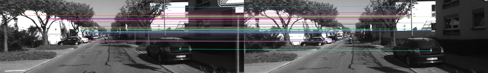
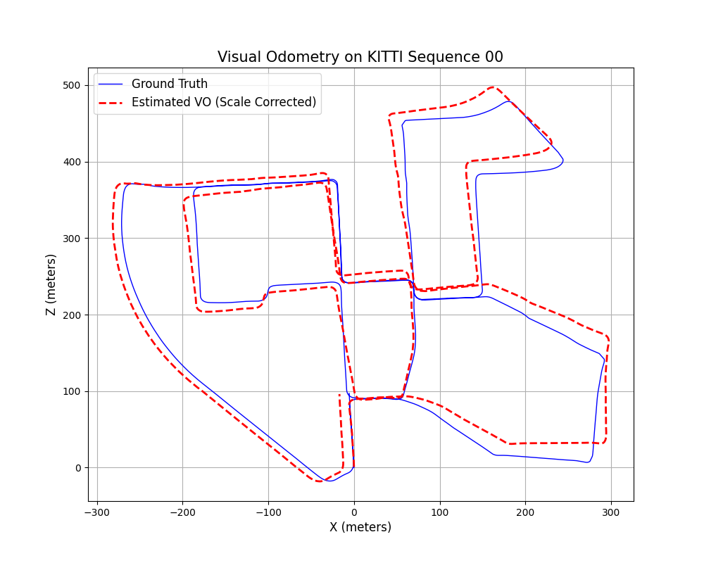

# Visual Odometry with Deep Features 🚗📷


A monocular visual odometry pipeline using GFTT+ORB features and geometric pose estimation, evaluated on the KITTI Odometry dataset. The system achieves accurate trajectory reconstruction on Sequence 00, with close alignment to ground truth over the majority of the route.

## ✨ Key Features

- **Feature Extraction:** GFTT (Shi-Tomasi) corner detector combined with ORB descriptors for robust, well-distributed keypoints. Designed to be swappable with deep learning features (e.g., SuperPoint).
- **Feature Matching:** Brute-force matching with Lowe's ratio test (threshold 0.75) for high-quality, low-outlier correspondences.
- **Geometric Verification:** Essential Matrix estimation with RANSAC (threshold 0.5 px, confidence 0.999) for robust outlier rejection. Degenerate frames (< 20 inliers) are automatically skipped.
- **Correct Pose Convention:** `cv2.recoverPose` output is properly inverted to obtain camera motion in world coordinates, avoiding trajectory drift caused by convention mismatch.
- **Trajectory Recovery:** Monocular scale-corrected trajectory reconstruction using ground truth inter-frame distances.
- **Evaluation:** Direct comparison against KITTI Ground Truth trajectories, with world-frame alignment at frame 0.

## ⚙️ System Pipeline

```
Image Input
    │
    ▼
Feature Detection & Description   (GFTT detector + ORB descriptor)
    │
    ▼
Feature Matching                  (BFMatcher + Lowe's ratio test)
    │
    ▼
Epipolar Geometry                 (Essential Matrix via RANSAC)
    │
    ▼
Pose Recovery (R & t)             (recoverPose → inverted to world frame)
    │
    ▼
Scale Correction                  (GT inter-frame distance applied to |t|=1)
    │
    ▼
Trajectory Integration            (T_global = T_global @ T_rel)
```

## 🛠️ Installation

Clone the repository and install the required dependencies:

```bash
git clone https://github.com/Jingchen-Chen/visual-odometry-project.git
cd visual-odometry-project
pip install -r requirements.txt
```

## 🚀 Usage

1. Download the [KITTI Odometry dataset (grayscale)](https://www.cvlibs.net/datasets/kitti/eval_odometry.php) and place it so sequences are at `data/dataset/sequences/` and ground truth poses at `data/dataset/poses/`.
2. Run the pipeline:

```bash
python main.py
```

Results are saved to the `results/` directory.

## 📊 Results

### 1. Feature Matching (Frontend)

<p align="center">
  
  <br>
  <em>Figure 1: GFTT+ORB feature matching between consecutive frames (top 50 shown).</em>
</p>

### 2. Trajectory Comparison (Estimated vs. Ground Truth)

<p align="center">
  
  <br>
  <em>Figure 2: Estimated trajectory (red dashed) vs. ground truth (blue) on KITTI Sequence 00. Strong alignment is maintained throughout the majority of the ~3.7 km route.</em>
</p>

## 📈 Error Analysis & Drift

The current system achieves good trajectory alignment for the first ~60% of Sequence 00. Drift accumulates in the latter half, which is expected behavior for a purely monocular VO system without any backend optimization.

**Key corrections applied vs. naive baseline:**

| Issue | Root Cause | Fix Applied |
|-------|-----------|-------------|
| Z-axis mirror | `recoverPose` outputs world-to-camera transform; needed camera-to-world | Invert: `R_rel = R.T`, `t_rel = -R.T @ t` |
| Trajectory offset | Pre-inserted `(0,0)` in estimated list misaligned indices | Removed phantom point; start list empty |
| Coordinate frame mismatch | Estimated trajectory in camera frame, GT in world frame | Apply GT frame-0 pose: `T_world = gt_start @ T_global` |
| Degenerate frames | Low-match or low-inlier frames producing garbage poses | Skip if matches < 30 or inliers < 20 |
| Weak keypoints | ORB detector produces unevenly distributed corners | Replaced with GFTT (Shi-Tomasi) detector |

**Remaining drift sources (future work):**

- No loop closure — accumulated rotation error goes uncorrected
- No Bundle Adjustment — local pose refinement would reduce drift
- Binary ORB descriptors — replacing with SuperPoint + SuperGlue would improve matching in low-texture and motion-blur scenarios
- Single-camera only — adding stereo or IMU would remove the need for GT-based scale correction entirely

## 📁 Project Structure

```
visual-odometry-project/
├── main.py                     # Entry point
├── modules/
│   ├── feature_extraction.py   # GFTT + ORB
│   ├── matching.py             # BFMatcher + ratio test
│   ├── pose_estimation.py      # Essential matrix + recoverPose
│   ├── utils.py                # Trajectory plotting + GT alignment
│   └── dataset.py              # KITTI dataset loader
├── data/
│   └── dataset/
│       ├── sequences/00/image_0/   # Input images
│       └── poses/00.txt            # Ground truth poses
├── results/                    # Output images
└── requirements.txt
```